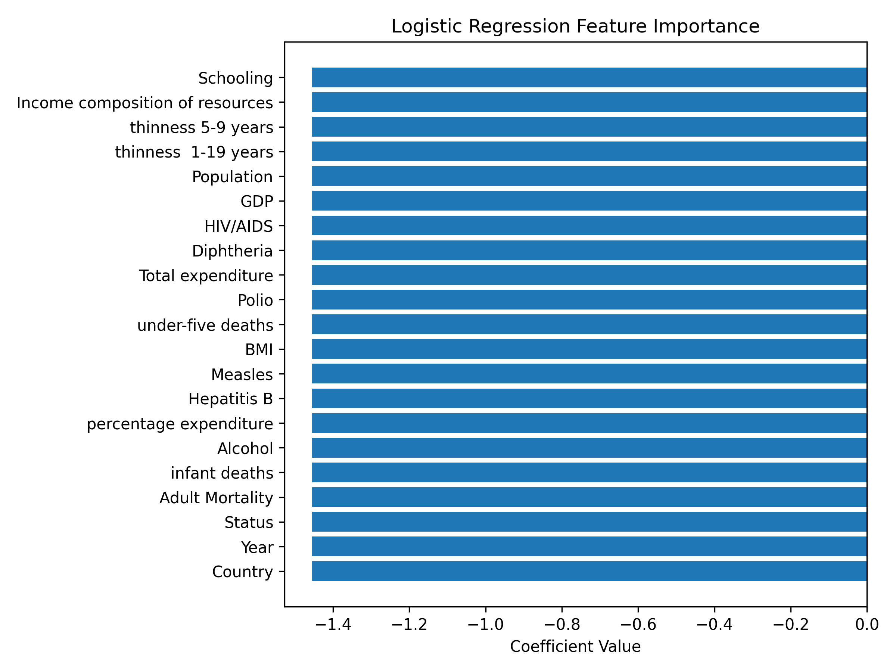
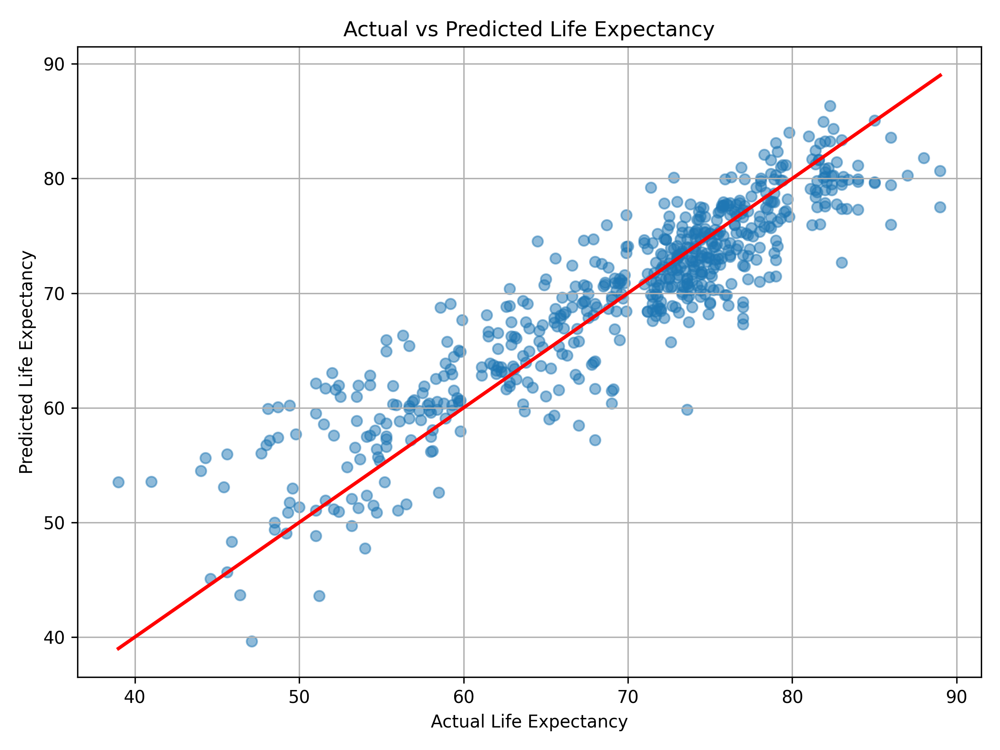

# Life Expectancy Prediction using Machine Learning

## Project Overview

This project predicts **life expectancy of countries** using machine learning techniques.
The model analyzes **health, economic, and demographic indicators** to estimate life expectancy.

The workflow includes **data preprocessing, feature engineering, model training, evaluation, and visualization**.

A **Linear Regression model** is trained using a machine learning pipeline to ensure consistent preprocessing and prediction.

---

## Dataset

The dataset used in this project is **Life Expectancy Data**, which contains health and socioeconomic indicators for multiple countries over several years.

### Main Features

* Country
* Year
* Adult Mortality
* Infant deaths
* Alcohol consumption
* Hepatitis B immunization
* GDP
* Population
* BMI
* Schooling
* Income composition of resources
* Status (Developed / Developing)

**Target Variable:**
Life expectancy

---

## Project Workflow

### 1. Data Loading

The dataset is loaded using **pandas** for analysis and preprocessing.

### 2. Data Cleaning

Data cleaning steps include:

* Removing rows where **life expectancy is missing**
* Handling missing values using:

  * **Country-wise median imputation**
  * **Global median imputation** when country-level data is unavailable

### 3. Feature Preprocessing

Two types of preprocessing were applied.

**Categorical Features**

* One-hot encoding applied to the `Status` column

**Numerical Features**

* Standard scaling applied using a scaler

These transformations were implemented using **ColumnTransformer**.

### 4. Machine Learning Pipeline

A pipeline was built to combine preprocessing and model training.

Pipeline components:

* Data preprocessing
* Linear Regression model

Using a pipeline ensures that **the same preprocessing steps are applied during both training and prediction**.

### 5. Model Evaluation

The model performance was evaluated using:

* **Mean Absolute Error (MAE)**
* **Mean Squared Error (MSE)**
* **Root Mean Squared Error (RMSE)**
* **R² Score**

The model was also validated using **5-fold cross-validation** to measure its generalization performance.

---

## Feature Importance Analysis

Feature importance analysis was performed to understand **which variables influence life expectancy the most**.

This helps identify key factors such as:

* Schooling
* Adult Mortality
* GDP
* Income composition
* BMI

The importance scores are visualized in the following plot.

---

## Prediction Visualization

The project also includes a visualization comparing **actual vs predicted life expectancy values**.

Points closer to the **diagonal line** indicate more accurate predictions.

---

## Technologies Used

* Python
* NumPy
* Pandas
* Matplotlib
* Scikit-learn

---

## Project Structure

life-expectancy-ml-project
│
├── data
│   └── Life Expectancy Data.csv
│
├── notebooks
│   └── analysis.ipynb
│
├── src
│   └── model.py
│
├── images
│   ├── prediction_plot.png
│   └── feature_importance_plot.png
│
└── README.md

---

## Future Improvements

Possible improvements for this project:

* Try advanced models such as **Random Forest** or **Gradient Boosting**
* Perform **hyperparameter tuning**
* Add **feature selection techniques**
* Build a **web application for prediction**
* Deploy the model using **Flask or FastAPI**
